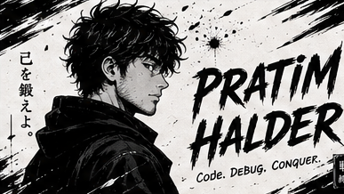
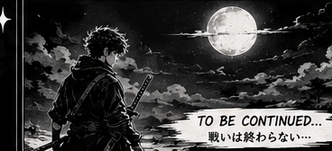

<div align="center">




<h1 align="center">Hi, I'm Pratim Halder 👋</h1>
<p align="center">Full-Stack Developer • Problem Solver • Java Enthusiast</p>

<p align="center">
  
</p>

<p align="center">
  <a href="https://github.com/pratim04"></a>
  <a href="https://github.com/pratim04?tab=followers"></a>
  <a href="https://github.com/pratim04?tab=stars"></a>
</p>

---

<div align="center">
  
</div>

## About me

I'm a Full-Stack Developer focused on building beautiful and useful web applications. I love learning new technologies (currently diving deeper into Java) and solving challenging problems.

```cpp
class Developer{
  String name = "Pratim Halder";
  String role = "Full Stack Developer";
  String location = "Earth";
  String currentProject = "Dashboard";
  String learning = "Java";
  String[] skills = {"React", "Node.js", ".NET", "MongoDB", "Tailwind"};
  String mantra = "Code. Debug. Conquer.";
}
```

---

## Tech Stack

<p align="center">
  
</p>

---

## Projects

| Project | Description | Stack |
|---|---:|:---|
| ⚔ Dashboard | Modern admin dashboard (WIP) | React • Node.js |
| 🛍 RetroRiwaaz | Full-stack e-commerce | React • Node.js • MongoDB |

> Want to see a specific project demo here? Tell me which one and I'll add a preview.

---

## GitHub Stats

<div align="center">
  
  
</div>

---

## Activity & Streak

<div align="center">
  
  <br/>
  
</div>

---

## Current Goals

- Learn and master Java
- Finish building the Dashboard project
- Improve problem solving and algorithms

---

## Connect

> Please update these links with your real contact details — I left placeholders for privacy.

<p align="center">
  <a href="mailto:YOUR_EMAIL"></a>
  <a href="https://linkedin.com/in/YOUR_LINK"></a>
  <a href="https://twitter.com/YOUR_TWITTER"></a>
  <a href="YOUR_PORTFOLIO"></a>
</p>

---

<div align="center">
  
  
  ### 「戦いは終わらない」
  #### Keep Building • Keep Learning • Keep Fighting
</div>
