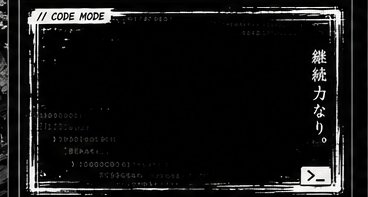

<div align="center">


</div>

---

<table width="100%">
  <tr>
    <td width="38%" valign="top">

<!-- LEFT COLUMN -->

<div align="left">

### 👋 Hi — I'm Pratim Halder

**Code. Debug. Conquer.**

BCA Student • Full Stack Developer

Building digital products with clean, maintainable code.

- 📍 Kolkata, India
- ✉️ pratimhalder2004@gmail.com
- 🔗 [GitHub/pratim04](https://github.com/pratim04)


---

### ⚔ Battle Statistics

- Total commits: **1.2k+**
- Pull requests: **180+**
- Issues solved: **160+**
- Repositories: **35+**
- Stars earned: **450+**
- Lines of code: **50k+**

---

### // CODE MODE

```js
// Life's Algorithm
while(alive) {
  code();
  debug();
  learn();
  improve();
  conquer();
}
```

---

### 🧰 Tech Stack

<p align="left">

</p>

---

### 🏆 Achievements

- Inter Department Football Champion (IEM)
- Consistent Learner
- Builder & Problem Solver
- Always Improving

---

### 📈 DSA Journey

- Arrays & Strings — ██████████ 100%
- Recursion & Backtracking — ████████░░ 80%
- Linked List — █████████░░ 90%
- Trees — ████████░░ 75%
- Graphs — ███████░░░ 65%

</div>

    </td>
    <td width="62%" valign="top">

<!-- RIGHT COLUMN -->

<div align="center">

<!-- contribution graph and stats -->

<table width="100%">
  <tr>
    <td valign="top" width="60%">
      <h3>Contribution Graph</h3>
      
    </td>
    <td valign="top" width="40%">
      <h3>Current Streak</h3>
      <p style="font-size:28px; margin:6px 0; color:#ff6666"><b>28</b> days</p>
      <h3>Languages</h3>
      
    </td>
  </tr>
</table>

---

<h3>Activity Overview</h3>


---

<h3>Current Focus</h3>

- Mastering DSA
- Full Stack Development (React / Node / .NET)
- System Design
- Building Scalable Projects
- Contributing to Open Source

---

<h3>Featured Projects</h3>

| Project | Description | Stack |
|---|---|---|
| ⚔ Dashboard | Modern Admin Dashboard (WIP) | React • Node.js |
| 🛍 RetroRiwaaz | Full-stack E-commerce | React • Node.js • MongoDB |

<p align="center">

</p>

</div>

    </td>
  </tr>
</table>

---

<div align="center">
  

  <p style="margin-top:8px;">“The only limit is the one you set yourself.”</p>
</div>
